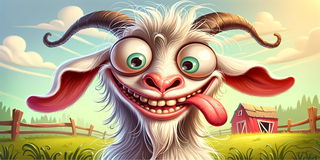

```
.----------------.  .----------------.  .----------------.  .----------------.
| .--------------. || .--------------. || .--------------. || .--------------. |
| |    ______    | || |     ____     | || |      __      | || |  _________   | |
| |  .' ___  |   | || |   .'    `.   | || |     /  \     | || | |  _   _  |  | |
| | / .'   \_|   | || |  /  .--.  \  | || |    / /\ \    | || | |_/ | | \_|  | |
| | | |    ____  | || |  | |    | |  | || |   / ____ \   | || |     | |      | |
| | \ `.___]  _| | || |  \  `--'  /  | || | _/ /    \ \_ | || |    _| |_     | |
| |  `._____.'   | || |   `.____.'   | || ||____|  |____|| || |   |_____|    | |
| |              | || |              | || |              | || |              | |
| '--------------' || '--------------' || '--------------' || '--------------' |
'----------------'  '----------------'  '----------------'  '----------------'
```

# Golang Automated Tests
a collection of useful automated tools whose sole purpose is to make software engineers' lives easier

## License
This project is licensed under the [MIT License](https://opensource.org/license/mit) - see the [LICENSE](LICENSE) file for details.
